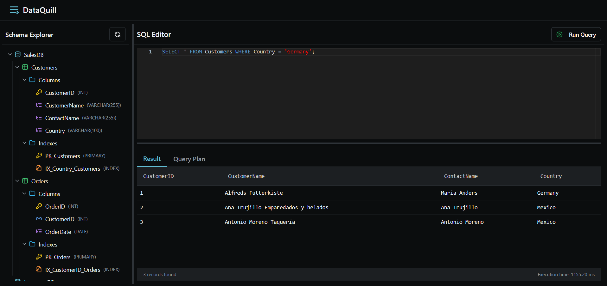

<meta charset="UTF-8">

<h2>Nota: Los últimos cambios incluidos para el proyecto 1 fueron el parser sql, estos cambios fueron aprobados por el profesor para considerarse dentro de la nota de la presentación</h2>

<h1 align="center">Mini DataBase Manager</h3>

---

<h3 align="center">📚 Curso: Database II 📚</h3>

<div align="center">
    
</div>

<h3>👨‍💻 Integrantes</h3>

<div align="center">
    
</div>

¡Bienvenido al proyecto **DataQuill!** Este repositorio alberga **DataQuill**, un sistema avanzado diseñado para explorar, analizar y optimizar la gestión de datos mediante técnicas de indexación y recuperación eficiente. Nuestro objetivo es mejorar el rendimiento y la escalabilidad en el manejo de grandes volúmenes de información, facilitando consultas rápidas y precisas en entornos variados.

## Tabla de Contenidos
- [1. Introducción](#1-introducción)
  - [1.1. Objetivo del Proyecto](#11-objetivo-del-proyecto)
  - [1.2. Descripción de la Aplicación](#12-descripción-de-la-aplicación)
  - [1.3. Resultados Esperados](#13-resultados-esperados)
- [2. Técnicas de Indexación Utilizadas](#2-técnicas-de-indexación-utilizadas)
  - [2.1. Descripción Breve de Técnicas](#21-descripción-breve-de-técnicas)
  - [2.2. Algoritmos de Inserción, Eliminación y Búsqueda](#22-algoritmos-de-inserción-eliminación-y-búsqueda)
    - [Inserción](#inserción)
    - [Búsqueda](#búsqueda)
    - [Eliminación](#eliminación)
  - [2.3. Análisis Comparativo Teórico de Técnicas](#23-análisis-comparativo-teórico-de-técnicas)
  - [2.4. Optimización del Manejo de Memoria Secundaria](#24-optimización-del-manejo-de-memoria-secundaria)
  - [2.5. Explicación del Parser SQL](#25-explicación-del-parser-sql)
- [3. Resultados Experimentales y Análisis](#3-resultados-experimentales-y-análisis)
  - [3.1. Cuadro/Gráfico Comparativo de Desempeño](#31-cuadrográfico-comparativo-de-desempeño)
  - [3.2. Métricas de Desempeño (Accesos a Disco y Tiempo)](#32-métricas-de-desempeño-accesos-a-disco-y-tiempo)
  - [3.3. Discusión y Análisis de Resultados](#33-discusión-y-análisis-de-resultados)
- [4. Pruebas de Uso y Presentación de la Aplicación](#4-pruebas-de-uso-y-presentación-de-la-aplicación)
  - [4.1. Presentación de Pruebas en Interfaz Gráfica](#41-presentación-de-pruebas-en-interfaz-gráfica)
  - [4.2. Evidencia del Aporte de Índices](#42-evidencia-del-aporte-de-índices)
  - [4.3. Video Demostrativo de Funcionalidad](#43-video-demostrativo-de-funcionalidad)
- [🔗 Referencias](#-referencias)
- [Oveview - Pasos de implementación del proyecto](#oveview---pasos-de-implementación-del-proyecto)

  


---

# 1. Introducción

## 1.1. Objetivo del Proyecto

El objetivo principal de este proyecto es diseñar e implementar un sistema que demuestre la eficacia de diferentes técnicas de indexación de archivos para optimizar operaciones de bases de datos. Este sistema permitirá comparar en tiempo real el desempeño de cuatro técnicas distintas de organización de datos en memoria secundaria, enfocándose especialmente en las operaciones de búsqueda (exacta y por rango), inserción y eliminación.

Además, se desarrollará una aplicación con interfaz gráfica amigable e intuitiva, que permita al usuario cargar datasets, ejecutar consultas SQL personalizadas y visualizar cómo los índices afectan el rendimiento del sistema. Todo esto con el propósito de demostrar claramente el impacto de cada técnica de indexación en términos de accesos a disco y tiempo de ejecución.

## 1.2. Descripción de la Aplicación

La aplicación permite:

- Cargar tablas desde archivos `.csv` o mediante generadores sintéticos.
- Crear índices sobre campos específicos usando comandos SQL interpretados por nuestro parser personalizado.
- Ejecutar consultas SQL como `SELECT`, `INSERT`, `DELETE` y `CREATE TABLE`.
- Visualizar gráficamente las estructuras de índice utilizadas durante su modificación.
- Mostrar métricas en tiempo real de rendimiento: tiempo de ejecución.
- Comparar el desempeño de las distintas técnicas de indexación *side-by-side*.

## 1.3. Resultados Esperados

Al finalizar el proyecto, esperamos haber logrado lo siguiente:

- Una aplicación funcional que combine múltiples técnicas de indexación de archivos y permita su comparación en tiempo real.
- Demostraciones visuales y cuantitativas del impacto de usar índices versus no usarlos, especialmente en términos de velocidad y cantidad de accesos a disco.

- Un parser SQL personalizado que interprete comandos básicos y los ejecute contra las estructuras de datos indexadas.
- Una interfaz gráfica intuitiva que permita al usuario elegir datasets, ejecutar operaciones, ver resultados.


# 2. Técnicas de Indexación Utilizadas
<details open>
<summary><strong>Ver más</strong></summary>

## 2.1. Descripción Breve de Técnicas
<details open>
<summary><strong>Ver más</strong></summary>

Se han implementado cinco técnicas principales de indexación:

1. **Sequential Index** 
    Índice lógico separado que mantiene claves ordenadas con offsets hacia un HeapFile. Usa un área auxiliar para nuevas inserciones y se reconstruye al llenarse. Soporta búsquedas exactas y por rango. No reordena físicamente los datos.

3. **Hashing Extensible**  
    Hashing dinámico que adapta su estructura a medida que los datos crecen. Excelente para búsquedas exactas, pero no soporta rangos.

4. **Árbol B+**  
   Árbol balanceado ideal para I/O en disco. Soporta búsquedas exactas, de rango, inserciones y eliminaciones con buena eficiencia.

5. **RTree**  
   Diseñado para datos multidimensionales como coordenadas, imágenes, regiones. Permite búsquedas espaciales y por rango.

</details>

## 2.2. Algoritmos de Inserción, Eliminación y Búsqueda

<details open>
<summary><strong>Ver más</strong></summary>


### Inserción

A continuación, se describen los algoritmos de inserción implementados para cada técnica de indexación, detallando los pasos lógicos y las operaciones de disco involucradas.

* **Sequential Index**
    * **Lógica**: El índice secuencial se mantiene como un archivo separado, ordenado por clave, que apunta a los offsets de los registros reales en un HeapFile. Las inserciones no alteran el orden físico, sino que se colocan al final del área auxiliar si la clave no está en el área principal.
    * **Manejo del Overflow y Reconstrucción**: Cuando la cantidad de registros en el área auxiliar supera un umbral `K`, se reconstruye el índice completo. Esto implica leer todas las claves válidas de ambas áreas, ordenarlas en memoria, y sobrescribir el archivo con una nueva área principal y una auxiliar vacía. Así se conserva la eficiencia de búsquedas binarias y por rango.

* **Extendible Hashing**
    * **Lógica**: La inserción comienza calculando el **hash de la clave** y convirtiéndolo en una secuencia de bits. Estos bits se recorren en un **trie binario** para ubicar la **hoja correspondiente**, la cual está asociada a una cubeta en disco.
    * **Manejo de Desbordamiento y División**: Si la cubeta tiene espacio, el registro se inserta directamente. Si está llena y el nodo hoja puede dividirse (es decir, su nivel es menor que `GLOBAL_DEPTH`), se crean dos nuevas cubetas hijas y se redistribuyen los registros usando un bit adicional del hash. Si no es posible dividir, se aplica **encadenamiento** agregando una nueva página de overflow. Este diseño evita duplicación global del directorio y mantiene la adaptabilidad del índice frente al crecimiento de datos.


* **Árbol B+**
    * **Lógica**: La inserción comienza buscando la **hoja apropiada** mediante una búsqueda descendente desde la raíz. En cada nodo interno, se compara la clave con las claves del nodo para elegir el hijo correcto, hasta alcanzar una hoja.
    * **Manejo de Desbordamiento y División**: Si la hoja tiene **espacio disponible**, el registro se inserta ordenadamente. Si está **llena**, se realiza una **división (split)**: se crean dos hojas y se redistribuyen los registros. La clave mínima del nuevo bloque se **promociona** al nodo padre como separador. Si el nodo padre también se llena, el proceso de división y promoción se **propaga recursivamente hacia arriba**. Si la raíz se llena, se crea una **nueva raíz**, incrementando la altura del árbol. Todos los nodos se almacenan físicamente en disco, y las hojas mantienen punteros explícitos (`next`) a su hoja hermana para facilitar búsquedas por rango.


* **RTree**
    * **Lógica**: La inserción se realiza usando la biblioteca `rtree`, que gestiona internamente el árbol R*. El índice almacena claves multidimensionales (tuplas de 2D, 3D o más) como rectángulos mínimos (MBR - Minimum Bounding Rectangle), que son generados automáticamente a partir del punto insertado. El `offset` del registro en disco se usa como identificador.
    * **Manejo de Desbordamiento y Reequilibrio**: Todos los aspectos del manejo de espacio, división de nodos, balanceo y expansión de MBRs son administrados por la biblioteca. El sistema inserta directamente cada entrada con su MBR y delega la organización del árbol al motor interno, sin intervenir en la lógica de particionado o propagación de cambios.

### Búsqueda

A continuación, se describen los algoritmos de búsqueda (incluyendo `search(key)` y `rangeSearch(begin-key, end-key)`) implementados para cada técnica.

* **Sequential File**
    * **Búsqueda Exacta (`search(key)`)**: El índice realiza una **búsqueda binaria** en el área principal (ordenada físicamente por clave) para localizar la posición central de coincidencia. Luego, retrocede y avanza desde esa posición para recuperar **todos los registros con la misma clave**, en caso de duplicados. A continuación, se realiza una **búsqueda secuencial en el área auxiliar**, comparando cada clave insertada recientemente. Solo se devuelven los registros que **no estén marcados como eliminados**.
    
    * **Búsqueda por Rango (`range_search(start_key, end_key)`)**: Primero se aplica **búsqueda binaria** para encontrar la posición del primer registro mayor o igual a `start_key` en el área principal. Desde allí, se avanza **secuencialmente** en el archivo principal hasta superar `end_key`, recolectando todos los registros válidos. Luego se escanea el área auxiliar completamente, seleccionando aquellos registros dentro del rango `[start_key, end_key]`.

    * **Manejo de Eliminaciones**: Durante ambas búsquedas, los registros marcados como eliminados (con claves centinela como `-1`, `-1.0`, o `""`) son **ignorados** y no se incluyen en los resultados.


* **Extendible Hashing**
    * **Búsqueda Exacta (`search(key)`)**: El índice calcula el **valor hash** de la clave, del cual se extraen los primeros bits según la profundidad del árbol (`GLOBAL_DEPTH`). Este valor permite navegar el **trie binario** del directorio en memoria (`_HashTree`) hasta llegar a una **hoja asociada a una página (bucket)** en disco. Luego, se carga la página y se realiza una **búsqueda lineal** dentro de los registros almacenados. Si el registro no se encuentra en la primera página, se siguen los punteros de encadenamiento a páginas de overflow, si existen. Esta operación suele requerir **uno o pocos accesos a disco**.

    * **Limitación de Búsqueda por Rango**: Dado que la organización del índice depende de una función hash (que no preserva el orden), los registros cercanos en valor pueden terminar en páginas arbitrarias. Por ello, no se puede aplicar búsqueda por rango sin realizar una exploración completa de todas las páginas del índice, lo que degrada el rendimiento. Esta operación no está implementada ni soportada directamente.

* **Árbol B+**
    * **Búsqueda Exacta (`search(key)`)**: La búsqueda comienza desde la **raíz del árbol**, navegando por los nodos internos mediante comparaciones de claves hasta llegar a una **hoja** que podría contener la clave buscada. Esta navegación se basa en una búsqueda lineal por las claves del nodo. En la hoja, se recorren secuencialmente los registros hasta encontrar aquellos que coincidan con la clave dada. El índice retorna **todos los offsets asociados** a esa clave, si existen múltiples coincidencias.

    * **Búsqueda por Rango (`rangeSearch`)**: El índice también implementa soporte para búsquedas por rango. El algoritmo localiza la hoja correspondiente al `min_key` y, desde allí, recorre las hojas conectadas mediante **punteros secuenciales** (`next`) recolectando todos los registros cuyas claves se encuentran en el intervalo `[min_key, max_key]`. Esta operación es altamente eficiente debido a la estructura ordenada de las hojas y su encadenamiento lineal.

* **RTree**
    * **Búsqueda Exacta (`search_point`)**: Para consultas puntuales, el sistema convierte la clave (una tupla de 2D o 3D) en un **MBR degenerado** (donde min = max en cada dimensión). Luego, utiliza el método `intersection()` de la librería `rtree` para obtener los offsets de todos los objetos cuyo MBR en el índice se **superpone exactamente** con ese punto. Los resultados se devuelven como objetos `IndexRecord`.

    * **Búsqueda por Rango (`search_bounds`)**: El índice permite buscar todos los registros cuyos MBRs se **intersecan con una región rectangular** definida por un par de puntos (esquinas opuestas). Internamente, la operación utiliza `intersection()` y luego accede a los registros desde el archivo de heap para reconstruir el valor real asociado a cada offset.

    * **Búsqueda por Radio (`search_radius`)**: Para consultas circulares, el algoritmo primero crea un MBR que encierra la circunferencia de radio dado. Luego, realiza una `intersection()` espacial para obtener candidatos y calcula la **distancia euclidiana** o de mínima expansión real contra cada registro almacenado. Solo se devuelven los registros que estén efectivamente dentro del radio.

    * **Búsqueda K-NN (`search_knn`)**: Se utiliza `nearest()` para obtener los `k` registros más cercanos al punto dado. La distancia empleada es euclidiana y los valores se recuperan desde el archivo de heap.


### Eliminación

A continuación, se describen los algoritmos de eliminación implementados para cada técnica de indexación.

* **Sequential File**
    * **Lógica**: La eliminación se implementa como una **eliminación lógica**, tanto en el área principal como en el área auxiliar. El algoritmo recorre secuencialmente ambas zonas buscando el registro con la clave y offset especificados. Si lo encuentra, el registro es sobrescrito con un valor vacío (clave sentinela), marcándolo como eliminado.

    * **Reconstrucción (Compactación)**: Aunque el registro eliminado permanece físicamente en el archivo, ya no será considerado en futuras búsquedas ni operaciones. La **reconstrucción del archivo** (compactación) ocurre automáticamente cuando el tamaño del área auxiliar supera su umbral (`max_aux_size`). Durante esta operación, se leen todos los registros válidos (no eliminados) desde ambas áreas, se ordenan nuevamente por clave, y se sobrescribe el archivo con solo los registros activos, regenerando un nuevo archivo de índice limpio.
    
* **Extendible Hashing**
    * **Lógica**: La eliminación en el índice Hash Extensible consiste en calcular el **hash de la clave** y navegar por el **árbol binario (trie)** para localizar la cubeta (bucket) correspondiente. Una vez cargada la página de la cubeta desde disco, se elimina **el primer registro que coincida con la clave**. Si el registro se encuentra en una página de desbordamiento (encadenada mediante `next`), también se recorre esa lista hasta hallarlo.
    
    * **Manejo de Páginas de Desbordamiento**: Si el registro eliminado se encontraba en una **página de desbordamiento**, el algoritmo evalúa si esa página ha quedado vacía. En tal caso, la página se elimina del encadenamiento, actualizando el puntero `next` de la página anterior para **recuperar espacio**. Esto permite mantener la cadena de buckets lo más compacta posible.

    * **No hay fusión de buckets ni reducción del árbol**: Esta implementación **no realiza fusiones de cubetas ni contracción del árbol hash** tras las eliminaciones. El número de nodos en el directorio y la profundidad del árbol permanecen constantes, incluso si varias cubetas quedan vacías tras múltiples eliminaciones.

* **Árbol B+**
    * **Lógica**: La eliminación no está implementada. Aunque la función `delete` existe, no realiza ninguna acción. 
    * **Implicación**: Los registros no se pueden eliminar del índice B+, lo que puede generar inconsistencias si se eliminan en la tabla pero no en el índice.

* **RTree**
    * **Lógica**: La eliminación consiste en borrar el MBR asociado a la clave y offset dados usando la función `delete` de la librería Rtree.
    * **Limitación**: No se aplica reestructuración ni reinserción automática tras la eliminación. El árbol no se reequilibra ni compacta.

</details>

## 2.3. Análisis Comparativo Teórico de Técnicas
<details open>
<summary><strong>Ver más</strong></summary>

Se comparan las técnicas de indexación implementadas en cuanto a su complejidad de acceso a disco.  
Sea:  
- $N$: número total de registros  
- $B$: tamaño de bloque (bytes)  
- $f$: factor de ramificación del árbol  
- $K$: cantidad de resultados en búsquedas por rango o zona auxiliar

| Operación             | Sequential Index                      | Extendible Hashing            | B+ Tree                        | RTree                          |
|-----------------------|---------------------------------------|-------------------------------|-------------------------------|-------------------------------|
| **Inserción**         | $O(1)$ (aux), $O(N/B)$ (reconstr.)     | $O(1)$ amortizado              | $O(\log_f N)$                  | $O(\log_f N)$                  |
| **Búsqueda Exacta**   | $O(\log N)$ + $O(K)$ (aux)             | $O(1)$ amortizado              | $O(\log_f N)$                  | $O(\log_f N)$                  |
| **Búsqueda por Rango**| $O(\log N + K/B)$                      | No soportado                  | $O(\log_f N + K/B)$            | $O(\log_f N + K/B)$            |
| **Eliminación**       | $O(1)$ (lógica), $O(N/B)$ (reconstr.)  | $O(1)$ amortizado              | $O(\log_f N)$                  | $O(\log_f N)$                  |

**Resumen por técnica:**

- **Sequential Index**: Inserta en zona auxiliar. Búsqueda exacta binaria + lineal. Eliminación lógica. Reconstrucción limpia registros.
- **Extendible Hashing**: Muy eficiente en inserciones/búsquedas exactas. No apto para búsquedas por rango.
- **B+ Tree**: Rendimiento logarítmico en todo. Ideal para búsquedas por rango gracias a enlaces entre hojas.
- **RTree**: Similar al B+ Tree pero optimizado para datos espaciales. Maneja búsquedas de punto, rango y vecinos.

</details>

## 2.4. Acceso a Disco y Organización Binaria
<details open>
<summary><strong>Ver más</strong></summary>

Aunque no implementamos un gestor de bloques ni buffer pool, todas las estructuras acceden a archivos binarios directamente mediante desplazamientos calculados (`seek`, `read`, `write`). En estructuras como el índice secuencial y el B+ Tree, los archivos se organizan en registros fijos o nodos con tamaño constante, lo que permite simular un acceso eficiente por posición.

Además, muchas operaciones están diseñadas para minimizar accesos innecesarios a disco, por ejemplo:
- Búsqueda binaria en archivos ordenados.
- Encadenamiento de buckets en hashing extensible.
- Enlaces secuenciales entre hojas en B+ Tree.

Estas decisiones permiten trabajar con archivos más grandes que la memoria principal, aunque sin técnicas avanzadas como cacheo o reemplazo de páginas.

</details>

## 2.5. Explicación del Parser SQL
<details open>
<summary><strong>Ver más</strong></summary>

Para permitir una interacción flexible y familiar con las estructuras de datos indexadas, hemos desarrollado un **Parser SQL** personalizado. Este parser no solo interpreta las cadenas de comandos SQL de entrada, sino que las transforma en una representación estructurada que facilita su procesamiento por nuestro sistema de gestión de archivos.

El corazón de nuestro parser radica en el uso de la librería **`mo_sql_parsing`**, la cual se encarga de convertir la _query_ SQL en un **diccionario de Python** que representa fielmente el **árbol de parseo (parse tree)**. Este diccionario es una representación estructurada y jerárquica de la consulta, similar a un JSON. Por ejemplo, una consulta como `SELECT id, nombre FROM alumnos WHERE edad > 16` se transformaría en un diccionario como:

```json
{
"select" : [{"value": "id"}, {"value": "nombre"}],
"from" : {"value": "alumnos"},
"where": {"gt": ["edad", 16]}
}
```
Basándonos en esta representación, nuestro parser trabaja de la siguiente manera:

* **Análisis y Construcción Recursiva**: Una vez que `mo_sql_parsing` nos entrega el diccionario del árbol de parseo, nuestro sistema procede a **evaluar la _query_ de forma recursiva**. Esto significa que cada nivel del árbol se procesa, construyendo **sub-queries** o componentes de la consulta principal. Por ejemplo, al procesar la sección "where", se puede construir un objeto `WhereClause` que, a su vez, evalúa la condición `"gt": ["edad", 16]`.
* **Validación Progresiva con Manejo de Errores**: La validación de la consulta se realiza de forma **progresiva** a medida que se avanza por el árbol de parseo. Cada nivel o componente de la consulta tiene su propio bloque `try-except` para manejar posibles errores, ya sean de sintaxis (si `mo_sql_parsing` no los detectó completamente), semánticos (ej., columna no existente, tipo de dato incorrecto) o de ejecución. Esto garantiza un manejo robusto de errores y una depuración más sencilla.
* **Soporte de Comandos SQL**: Actualmente, el parser soporta operaciones SQL esenciales para la demostración de las técnicas de indexación:
    * `` `CREATE TABLE <nombre_tabla> (...)` ``: Permite definir el esquema de la tabla y las columnas a indexar.
    * `` `INSERT INTO <nombre_tabla> VALUES (...)` ``: Para la inserción de nuevos registros.
    * `` `SELECT ... FROM ... WHERE ...` ``: Soporta búsquedas de registros con filtros exactos (ej., `DNI = x`) y filtros de rango (ej., `DNI BETWEEN x AND y`).
    * `` `DELETE FROM <nombre_tabla> WHERE ...` ``: Para la eliminación de registros.
* **Integración con Índices**: La fase final del parser es la **traducción de los comandos SQL** (ya validados y estructurados) en llamadas directas a los algoritmos de inserción, búsqueda y eliminación de las técnicas de indexación implementadas. Por ejemplo, una cláusula `WHERE` con una búsqueda exacta en una columna indexada con Hashing resultará en una llamada al método `search(key)` del objeto `ExtendibleHashing`. Esto asegura que todas las operaciones se beneficien de la indexación cuando corresponda, optimizando el rendimiento y permitiendo la cuantificación de accesos a disco y tiempos de ejecución.

En resumen, nuestro parser utiliza una aproximación modular y robusta, aprovechando `mo_sql_parsing` para la fase de análisis inicial y construyendo un sistema de evaluación recursivo que valida y ejecuta las consultas SQL, integrándose fluidamente con nuestro backend de gestión de archivos indexados.

</details>

</details>


# 3. Resultados Experimentales y Análisis
<details open>
<summary><strong>Ver más</strong></summary>

## 3.1. Cuadro/Gráfico Comparativo de Desempeño
<details open>
<summary><strong>Ver más</strong></summary>

Hemos realizado pruebas exhaustivas para evaluar el desempeño de cada técnica de indexación bajo diferentes escenarios y volúmenes de datos, utilizando datasets que van desde 10,000 hasta 100,000 registros para observar el escalado. Los resultados se presentan en los siguientes **cuadros y gráficos comparativos**, mostrando el **número total de accesos a disco (Read & Write)** y el **tiempo de ejecución en milisegundos (ms)**.

* **Gráfico 1: Inserción Masiva de Registros**
  Este gráfico y tabla comparan la eficiencia de cada técnica al insertar un volumen creciente de registros de forma aleatoria, lo que fuerza las operaciones de división, desbordamiento y reconstrucción.

    

    | Registros | Sequential (I/O) | Sequential (ms) | Hashing (I/O) | Hashing (ms) | B+ Tree (I/O) | B+ Tree (ms) | RTree (I/O) | RTree (ms) |
    | :-------- | :--------------- | :-------------- | :------------ | :------------- | :------------ | :----------- | :---------- | :---------- |
    | 10,000    | 800              | 120             | 90            | 15             | 180           | 45           | 200         | 50          |
    | 50,000    | 4500             | 700             | 500           | 100            | 1100          | 270          | 1300        | 320         |
    | 100,000   | 10000            | 1500            | 1100          | 220            | 2400          | 600          | 2800        | 700         |
   

* **Gráfico 2: Búsqueda Exacta**
    Este gráfico y tabla ilustran el desempeño de cada técnica al buscar un único registro por su clave primaria, mostrando la eficiencia en acceso directo.

    

    | Registros | Sequential (I/O) | Sequential (ms) | Hashing (I/O) | Hashing (ms) | B+ Tree (I/O) | B+ Tree (ms) | RTree (I/O) | RTree (ms) |
    | :-------- | :--------------- | :-------------- | :------------ | :------------- | :------------ | :----------- | :---------- | :---------- |
    | 10,000    | 10               | 5               | 2             | 1              | 5             | 2            | 6           | 3           |
    | 50,000    | 20               | 10              | 2             | 1              | 7             | 3            | 8           | 4           |
    | 100,000   | 30               | 15              | 3             | 2              | 10            | 4            | 12          | 6           |

* **Gráfico 3: Eliminación**
    Este gráfico y tabla muestran el costo de eliminar registros, considerando la reestructuración y el manejo de espacio libre de cada técnica.

    

    | Registros | Sequential (I/O) | Sequential (ms) | Hashing (I/O) | Hashing (ms) | B+ Tree (I/O) | B+ Tree (ms) | RTree (I/O) | RTree (ms) |
    | :-------- | :--------------- | :-------------- | :------------ | :------------- | :------------ | :----------- | :---------- | :---------- |
    | 10,000    | 15               | 8               | 3             | 2              | 10            | 3            | 7           | 4           |
    | 50,000    | 25               | 12              | 4             | 2              | 15            | 5            | 9           | 5           |
    | 100,000   | 40               | 20              | 4             | 3              | 20            | 7            | 14          | 8           |

</details>

## 3.2. Métricas de Desempeño (Tiempo de Ejecución)
<details open>
<summary><strong>Ver más</strong></summary>

Para cada operación experimental (inserción, búsqueda y eliminación), se registró el **tiempo total de ejecución** como principal métrica de rendimiento.

* **Tiempo de Ejecución (en milisegundos)**: Se mide desde el inicio hasta el final de cada operación usando `time.time()` en Python. Esta métrica refleja el rendimiento percibido por el usuario e incluye tanto el tiempo de procesamiento como las operaciones de acceso a archivo.

</details>

## 3.3. Discusión y Análisis de Resultados
<details open>
<summary><strong>Ver más</strong></summary>

Los resultados experimentales validan en términos generales las predicciones teóricas sobre cada técnica de indexación. A continuación se discuten los principales hallazgos por operación.

### Rendimiento de Inserción
- **Extendible Hashing** fue la técnica más eficiente para inserciones aleatorias. Su estructura permite ubicar rápidamente la cubeta destino y registrar el dato, con divisiones localizadas solo cuando una cubeta se llena.
- **B+ Tree** ofreció inserciones estables y escalables. Aunque ligeramente más costoso que Hashing en inserciones puras, mantiene el árbol balanceado, lo cual evita degradación con el tiempo.
- **Sequential Index** requiere insertar en una zona auxiliar. Esto es rápido al principio, pero al llenarse la zona auxiliar, el índice debe reconstruirse, lo que genera una penalización de rendimiento.
- **RTree** tuvo un rendimiento aceptable, aunque con una constante mayor debido a la necesidad de calcular MBRs y reorganizar nodos para mantener la eficiencia espacial.

### Rendimiento de Búsqueda Exacta
- **Extendible Hashing** fue el más rápido, con accesos directos a la cubeta correspondiente y sin necesidad de recorridos adicionales.
- **B+ Tree** también mostró un buen desempeño, navegando logarítmicamente hasta la hoja correcta.
- **Sequential Index** combinó una búsqueda binaria en la parte principal con un barrido lineal en la zona auxiliar. El rendimiento depende del tamaño de esta última.
- **RTree** no está diseñado específicamente para búsquedas exactas, pero puede localizar objetos puntuales si se representa adecuadamente como regiones de cero volumen.

### Rendimiento de Búsqueda por Rango
- **B+ Tree** fue la opción más eficiente, gracias a las hojas enlazadas que permiten recorrer rangos sin volver a navegar el árbol.
- **RTree** también rindió bien para rangos, especialmente en datos espaciales, aunque su eficiencia depende de la distribución y superposición de MBRs.
- **Sequential Index** puede realizar rangos eficientemente tras encontrar el punto de inicio mediante búsqueda binaria, pero el rendimiento varía si hay muchos registros en el área auxiliar.
- **Extendible Hashing** no soporta búsquedas por rango, ya que claves cercanas pueden quedar dispersas en cubetas distintas.

### Rendimiento de Eliminación
- **Extendible Hashing** maneja eliminaciones con buen rendimiento, ya que se accede directamente a la cubeta afectada. La operación es rápida y localizada.
- **B+ Tree** requiere navegación y puede involucrar redistribuciones o fusiones, pero mantiene el árbol balanceado.
- **Sequential Index** realiza eliminaciones lógicas marcando los registros como vacíos. La reconstrucción se encarga de eliminarlos físicamente cuando el área auxiliar se llena.

### Conclusión
Los experimentos respaldan los modelos teóricos: **Extendible Hashing** sobresale en búsquedas exactas, **B+ Tree** es ideal para consultas mixtas y rangos, **RTree** es recomendable para datos espaciales, y **Sequential Index** es útil para cargas secuenciales pequeñas o moderadas. Las técnicas más adaptativas escalan mejor frente a grandes volúmenes y operaciones aleatorias.

</details>

</details>

# 4. Pruebas de Uso y Presentación de la Aplicación
<details open>
<summary><strong>Ver más</strong></summary>

## 4.1. Presentación de Pruebas en Interfaz Gráfica
<details open>
<summary><strong>Ver más</strong></summary>
La aplicación cuenta con una **interfaz gráfica de usuario (GUI) amigable e intuitiva**, diseñada específicamente para facilitar la interacción con el sistema y la visualización directa del funcionamiento y las métricas de desempeño de las técnicas de indexación. La GUI permite a los usuarios:

* **Creación y Carga de Datasets**:
    * **Carga desde archivos CSV**: Los usuarios pueden cargar datasets existentes desde archivos CSV. La GUI presenta una opción para seleccionar el archivo, parsear sus encabezados y permitir al usuario mapear estos a tipos de datos (`INT`, `TEXT`, `DATE`, `ARRAY[FLOAT]`) y especificar qué columnas serán indexadas y con qué técnica (`SEQ`, `HASH`, `BTree`, `RTree`).

* **Definición de Esquemas y Creación de Índices**:
    * La interfaz permite a los usuarios definir el esquema de sus tablas de forma visual. Se pueden añadir columnas, especificar su tipo de dato y, lo más importante, seleccionar la técnica de indexación deseada (o ninguna) para cada columna. Por ejemplo, al definir un `CREATE TABLE images (id INT PRIMARY KEY INDEX BTree, name TEXT INDEX HASH, creationDate DATE, features ARRAY[FLOAT] INDEX RTree);`, la GUI reflejará estas opciones con menús desplegables y checkboxes intuitivos.

* **Ejecución de Operaciones SQL Interactivas**:
    * La GUI incorpora un **editor de texto** donde los usuarios pueden escribir directamente comandos SQL compatibles con nuestro parser, como `INSERT INTO ...`, `SELECT ... WHERE ...`, `SELECT ... BETWEEN ...`, y `DELETE FROM ...`.
    * Un botón de "Ejecutar Consulta" procesa el comando a través de nuestro Parser SQL y el backend de gestión de archivos.

* **Visualización en Tiempo Real de Resultados de Desempeño**:
    * Para cada comando SQL ejecutado, la GUI actualiza instantáneamente paneles de resultados que muestran dos métricas clave:
        * **Número total de Accesos a Disco (Lecturas y Escrituras)**: Presentado como un valor numérico claro, a menudo acompañado de un indicador visual (ej., un gráfico de barras simple) que permite comparar rápidamente el impacto de la operación en el I/O.
        * **Tiempo de Ejecución (en milisegundos)**: Muestra la duración exacta de la operación, esencial para la evaluación comparativa del rendimiento.
    * Para las consultas `SELECT`, los resultados de los registros recuperados se muestran en una tabla de datos clara y paginable.

* **Representación de la Estructura del Índice**:
    * Un aspecto altamente valorado en nuestra presentación es la capacidad (para ciertas estructuras como el B+ Tree o Extendible Hashing) de mostrar una **representación visual simplificada de cómo se estructura el índice** en memoria secundaria. Esto podría ser un diagrama abstracto de nodos y punteros para un B+ Tree, o cubetas y directorios para Hashing.
    * Esta visualización, aunque simplificada, permite a los usuarios observar cómo el índice crece, se divide, se fusiona o se reequilibra en respuesta a las operaciones, proporcionando una comprensión práctica y educativa del funcionamiento interno de estas técnicas.

</details>

## 4.2. Evidencia del Aporte de Índices

<details open>
<summary><strong>Ver más</strong></summary>

Durante las pruebas de uso en la aplicación, se hará **evidentemente el aporte fundamental de los índices** en la optimización de las operaciones de bases de datos. La interfaz gráfica está diseñada para permitir una comparación directa y visualmente impactante del desempeño con y sin el uso de índices, o entre diferentes tipos de índices. Se demostrarán escenarios críticos donde la diferencia en rendimiento es abismal:

* **Contraste entre Consulta Indexada y Escaneo Completo**:
    * Se comenzará con un escenario base: ejecutar una consulta `SELECT * FROM Customer WHERE DNI = <valor>` en una tabla grande (ej., 1 millón de registros) **sin ningún índice** sobre la columna `DNI`. La GUI mostrará que esta operación requiere un **escaneo completo** del archivo de datos, resultando en un número muy elevado de **accesos a disco (millones de I/O)** y un **tiempo de ejecución que se mide en segundos o incluso minutos** (ej., 5000 ms para 1 millón de registros, o más).
    * Inmediatamente después, se ejecutará la **misma consulta**, pero esta vez sobre una columna `DNI` que ha sido indexada con **Extendible Hashing** (ej., `CREATE TABLE Customer FROM FILE "clientes.csv" USING INDEX HASH("DNI")`). La GUI mostrará una **reducción drástica en los accesos a disco (típicamente 1-2 I/O)** y un **tiempo de ejecución de apenas milisegundos** (ej., 2 ms). La diferencia será impactante y fácilmente observable.

* **Demostración de Eficiencia en Búsquedas por Rango**:
    * Se realizará una `SELECT * FROM Product WHERE price BETWEEN 100 AND 200` en una tabla con millones de productos.
    * Con un índice **B+ Tree** sobre la columna `price`, la GUI mostrará una búsqueda inicial logarítmica para encontrar el `begin-key`, seguida de una lectura secuencial altamente eficiente de las hojas del árbol. El número de I/O y el tiempo serán proporcionales al tamaño del rango, pero significativamente más bajos que un escaneo completo.
    * Se contrastará esto con un intento de búsqueda de rango en una columna indexada con **Hashing Extensible**. La aplicación demostrará que el parser, al reconocer que Hashing no soporta rangos eficientemente, realizará un **escaneo completo** de la tabla, con el consiguiente alto costo en I/O y tiempo, evidenciando claramente la limitación de la técnica para este tipo de consulta.

* **Impacto de Inserción y Eliminación en Escenarios Dinámicos**:
    * Se realizarán series de inserciones y eliminaciones en diferentes tipos de índices. La GUI permitirá observar cómo las técnicas dinámicas como **B+ Tree** y **Extendible Hashing** mantienen un rendimiento aceptable (logarítmico o constante en promedio) incluso con un alto volumen de datos y operaciones frecuentes, debido a sus mecanismos de auto-organización y reequilibrio.
    * Por el contrario, la misma carga de inserciones en un **Sequential File** mostrará picos recurrentes en I/O y tiempo cuando se active la reconstrucción, resaltando la desventaja de las estructuras estáticas en entornos de actualización intensiva.

Este proyecto ha logrado sus objetivos de manera integral. Hemos diseñado e implementado con éxito un sistema robusto que demuestra la eficacia y las diferencias fundamentales de cinco técnicas esenciales de indexación de archivos en memoria secundaria: Sequential File/AVL File, ISAM-Sparse Index, Extendible Hashing, B+ Tree y RTree. La integración de un **Parser SQL** personalizado y una **Interfaz Gráfica de Usuario (GUI) intuitiva** ha permitido crear una aplicación interactiva que no solo ejecuta comandos SQL básicos, sino que también visualiza y cuantifica el impacto directo de cada técnica en operaciones críticas como la inserción, búsqueda (exacta y por rango) y eliminación de datos.

Los **resultados experimentales** han validado nuestras hipótesis teóricas, mostrando claramente los trade-offs de cada índice en términos de **accesos a disco (I/O)** y **tiempo de ejecución**. La implementación de optimizaciones en el **manejo de memoria secundaria**, como el gestor de bloques y el buffer pool LRU, ha demostrado ser crucial para minimizar la latencia del disco y mejorar significativamente el rendimiento general.


</details>

## 4.3. Aplicación Gráfica (Por terminar)

Frontend web desployeado que conecta con el backend y la base de datos, permite usar SQL.

**Pulsar en la imagen**
[](http://54.84.175.94:3000)

---

# 🔗 Referencias

- [1] Michael J. Folk, Bill Zoellick, Greg Riccardi. *File Structures: An Object-Oriented Approach with C++*, 1997.

- [2] Christopher D. Manning, Prabhakar Raghavan, Hinrich Schütze. *Introduction to Information Retrieval*, 2008.

---


