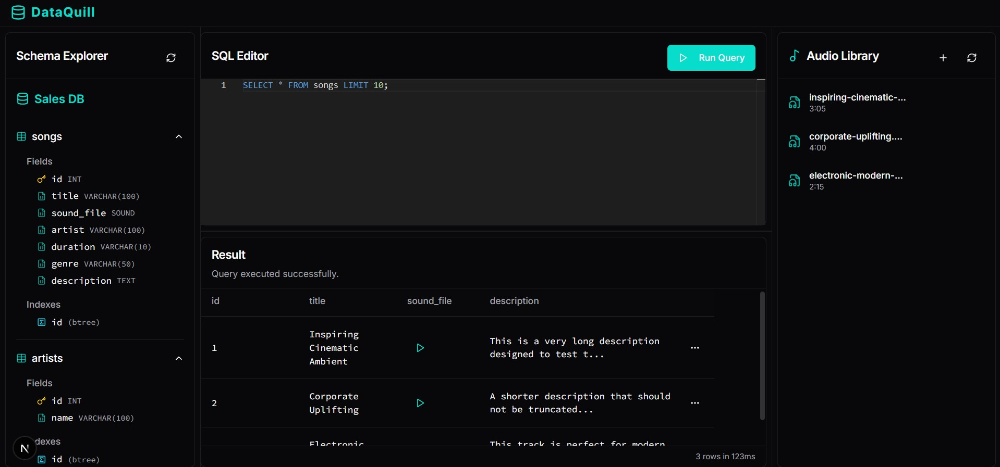
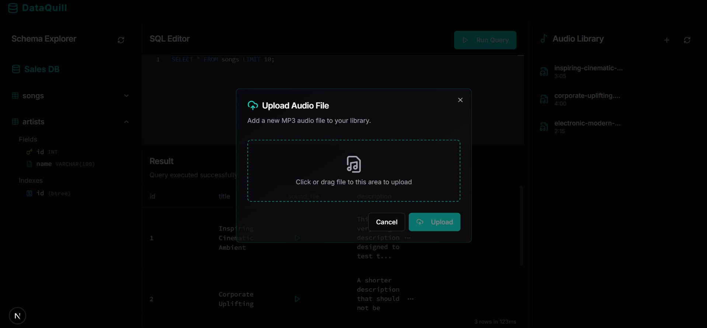
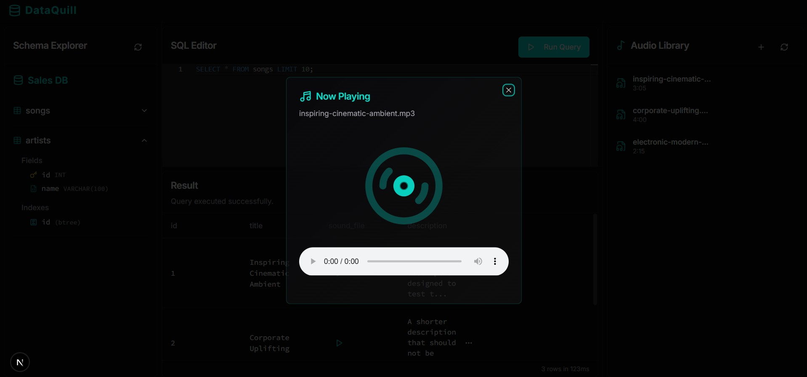
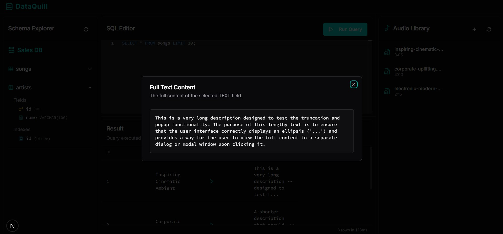

<h1 align="center">Mini DataBase Manager</h3>

---

<h3 align="center">📚 Curso: Database II 📚</h3>

<div align="center">
    
</div>

<h3>👨‍💻 Integrantes</h3>

<div align="center">
    
</div>


<div align="center">

# Indexación y Organización de Datos No Estructurados para Datos Multimedia

</div>


🔗 <u><strong><a href="https://deepwiki.com/GinoDazaU/base-de-datos-2-proyecto" target="_blank">
Haz clic aquí para ver la documentación del proyecto
</a></strong></u>
---

## 1. Introducción

Breve descripción del proyecto, motivación y objetivos generales.

- ¿Qué problema resuelve?
- ¿Qué funcionalidades principales tiene la aplicación?
- ¿Qué tipo de datos utiliza (texto, imágenes, audio)?
- ¿Qué tecnologías se emplean?

---

## 2. Arquitectura del Sistema

Diagrama arquitectónico general del sistema, describiendo los principales módulos:

- Preprocesamiento de datos
- Construcción de índices
- Módulo de consulta
- Interfaz de usuario
- Almacenamiento

Incluir un diagrama de flujo o arquitectura.

---

## 3. Índice Invertido Textual

### 3.1. Preprocesamiento

El preprocesamiento aplicado sigue el siguiente flujo:

**Tokenización → Eliminación de Stopwords → Stemming → Normalización**

A continuación se muestra un fragmento del código empleado:

```python
def preprocess(text: str) -> list[str]:
    text = text.lower()
    text = re.sub(r"[^\w\s]", " ", text)
    tokens = word_tokenize(text)
    filtered = [t for t in tokens if t.isalpha() and t not in STOPWORDS]
    return [STEMMER.stem(t) for t in filtered]
```

Este procesamiento se aplica tanto a los documentos como a las consultas para asegurar coherencia en el índice.

---

### 3.2. Construcción del Índice

La construcción del índice se implementa usando una variante del algoritmo **SPIMI (Single-pass In-Memory Indexing)** adaptada para entornos con restricciones de memoria, manteniendo la eficiencia de disco mediante escritura incremental y *streaming merge*.

#### Etapas del Algoritmo

1. **Recorrido de documentos**

   Se recorren todos los registros de la tabla que contienen campos `text`, procesando sus contenidos como un único documento textual por fila.

   Para cada documento:
   - Se aplica el preprocesamiento (tokenización, limpieza, stemming).
   - Se genera una lista de términos normalizados.
   - Se construye un diccionario en memoria con la frecuencia de cada término por `doc_id`.

2. **Escritura de bloques a disco (SPIMI clásico)**

   Cuando el diccionario de términos crece más allá de un umbral de memoria (en este caso, 4 KB), se descarga como un **bloque parcial ordenado** en disco:  
   `block_0.pkl`, `block_1.pkl`, ...

   Cada bloque es un diccionario ordenado por término, que contiene pares:  
   `'term' → {doc_id: frecuencia}`.

   Esto se repite hasta procesar todos los documentos, generando n bloques ordenados.

3. **Fusión en streaming de bloques (Streaming Merge)**

   Para evitar cargar todos los bloques en memoria, se realiza un merge externo en streaming usando un heap mínimo.

   - Se abre cada bloque y se crea un iterador ordenado.
   - Se inicializa un heap con el primer término de cada bloque.
   - Se repite:
     - Extraer el término más pequeño del heap.
     - Combinar todos los postings de ese término que aparezcan al tope de algún bloque.
     - Calcular el peso TF-IDF de cada (term, doc_id) directamente.
     - Acumular las normas parciales por documento.
     - Insertar el resultado directamente en un HeapFile (`inverted_index`).
     - Avanzar los iteradores de los bloques que contribuyeron con ese término.
     - Reinsertar el nuevo término al heap (si queda).

   Este procedimiento solo mantiene una línea por bloque en memoria al mismo tiempo, permitiendo escalar sin problema.

4. **Cálculo de normas y escritura**

   Las normas acumuladas de cada documento se convierten en su raíz cuadrada y se almacenan en una segunda tabla `inverted_index_norms` como `(doc_id, norm)`.

5. **Construcción de índices auxiliares**

   Para acelerar la búsqueda de términos, se construyen índices hash (`ExtendibleHashIndex`) sobre los campos `term` e `id`.

---

#### Ejemplo Guiado

Supongamos que tenemos una tabla `news` con los siguientes 4 documentos:

| ID | Content                         |
|----|---------------------------------|
| 1  | Trump is a robot                |
| 2  | Trump wins again                |
| 3  | The robot uprising begins       |
| 4  | Robot robot robot attacks Trump |

---

**Paso 1: Preprocesamiento**

Después de aplicar tokenización, stopwords y stemming:

- doc 1 → ['trump', 'robot']  
- doc 2 → ['trump', 'win']  
- doc 3 → ['robot', 'uprising', 'begin']  
- doc 4 → ['robot', 'robot', 'robot', 'attack', 'trump']

---

**Paso 2: Construcción de bloques**

Simulemos que el límite de memoria permite guardar **solo 3 términos** antes de hacer dump.

**Primer bloque (`block_0.pkl`):**

Términos procesados:

- 'trump' → {1:1, 2:1, 4:1}  
- 'robot' → {1:1, 3:1, 4:3}  
- 'win'   → {2:1}  

**Contenido final ordenado de `block_0.pkl`:**

```python 
'robot': {1:1, 3:1, 4:3},  
'trump': {1:1, 2:1, 4:1},  
'win': {2:1}  
```

**Segundo bloque (`block_1.pkl`):**  
Quedan los términos:

- 'uprising' → {3:1}  
- 'begin' → {3:1}  
- 'attack' → {4:1}  

**Contenido final ordenado de `block_1.pkl`:**

```python  
'attack': {4:1},  
'begin': {3:1},  
'uprising': {3:1}  
```

---

**Paso 3: Streaming Merge**

Se abren los bloques en modo iterador y se extrae el primer término de cada uno.

Inicializamos el heap mínimo con los primeros términos:

```python 
('attack', 1), ('robot', 0)  
```

Cada entrada es (término, bloque_id)

**Iteración 1:**  
- `min = attack` (bloque 1)  
- Se procesa: `{4:1}`  
- Se calcula su TF-IDF y se escribe en `inverted_index`  
- Avanzar iterador de bloque 1 → siguiente término: `begin`  
- Nuevo `heap`: `('begin', 1), ('robot', 0) `

**Iteración 2:**  
- `min = begin` (bloque 1)  
- Se procesa: `{3:1}`  
- Escribir  
- Avanzar → siguiente: `uprising`  
- Nuevo `heap`: `('robot', 0), ('uprising', 1)`

**Iteración 3:**  
- `min = robot` (bloque 0)  
- Se procesa: `{1:1, 3:1, 4:3}`  
- Escribir  
- Avanzar → siguiente: `trump`  
- Nuevo heap: `('trump', 0), ('uprising', 1)` 

**Iteración 4:**  
- `min = trump` (bloque 0)  
- Se procesa: `{1:1, 2:1, 4:1}`  
- Escribir  
- Avanzar → siguiente: `win`  
- Nuevo heap: `('uprising', 1), ('win', 0)`

**Iteración 5:**  
- min = `uprising` (bloque 1)  
- Se procesa: `{3:1}`  
- Escribir  
- Bloque 1 termina  
- Nuevo heap: `('win', 0)`

**Iteración 6:**  
- min = `win` (bloque 0)  
- Se procesa: `{2:1}`  
- Escribir  
- Fin de bloque 0

---

**Resultado Final:**

Se generó un índice invertido en disco con postings TF-IDF ordenados por término:

**inverted_index:**

```python  
'attack' → [[4, 0.75]]  
'begin' → [[3, 0.75]]  
'robot' → [[1, tfidf], [3, tfidf], [4, tfidf]]  
'trump' → ...  
'uprising' → ...  
'win' → ...  
```

**inverted_index_norms:**

```python
1 → norm1  
2 → norm2  
3 → norm3  
4 → norm4  
```

---

**Notas:**

- Nunca se cargó un bloque completo a RAM, solo una entrada por vez.
- El heap asegura que el término mínimo global esté siempre al frente.
- La salida final está ordenada sin necesidad de postprocesamiento adicional.


---


### Diagrama General

```plaintext
              ┌──────────────┐
              │  HeapFile    │ ← documentos textuales
              └───────┬──────┘
                      │
               Preprocesamiento
                      │
                      ▼
          ┌─────────────────────────┐
          │ Diccionario en Memoria  │
          │  term → {doc_id: freq}  │
          └───────────┬─────────────┘
                      │  (límite memoria)
                      ▼
            Dump a disco ordenado
                block_0.pkl, etc.
                      │
                      ▼
            Streaming Merge con Heap
            TF-IDF + Normas + Write
                      │
         ┌────────────┴──────────────┐
         ▼                           ▼
  inverted_index.dat      inverted_index_norms.dat
```

### 3.3. Consulta

La búsqueda textual se implementa usando el modelo vectorial con similitud de coseno, optimizada para evitar cargar todo el índice en memoria.

- **Consulta en lenguaje natural**:  
  El usuario ingresa una frase libre que es preprocesada con los mismos pasos que los documentos: tokenización, stopwords, stemming y normalización.

- **Similitud de coseno**:  
  Para cada documento que contiene al menos un término de la consulta, se calcula la similitud de coseno entre su vector TF-IDF y el de la consulta:

  $$
  \cos(\theta) = \frac{\vec{q} \cdot \vec{d}}{\|\vec{q}\| \cdot \|\vec{d}\|}
  $$

  Donde:  
  - $\vec{q}$ es el vector TF-IDF de la consulta.  
  - $\vec{d}$ es el vector TF-IDF del documento.  
  - $\|\vec{d}\|$ es la norma precalculada del documento.

  Esto permite obtener un ranking de documentos por relevancia semántica.

- **Recuperación Top-K eficiente**:  
  Se usa un índice hash extensible para acceder rápidamente a los postings de cada término, evitando recorrer el índice completo.  
  Solo los documentos relevantes se mantienen en memoria, permitiendo escalar a grandes colecciones.


---


## 4. Indexación de Datos Multimedia

### 4.1. Extracción de Características

- Descriptores utilizados (e.g., MFCC para audio, ResNet50 para imágenes)  
- Librerías empleadas  

### 4.2. Construcción del Diccionario Visual / Acústico

- K-Means sobre los descriptores locales  
- Visual/acoustic words  
- Representación de cada objeto como histograma  

### 4.3. Búsqueda KNN Secuencial

- TF-IDF sobre histogramas  
- Similitud de coseno  
- Recuperación eficiente con heap (Top-K)

### 4.4. Búsqueda KNN con Indexación Invertida

- Estructura del índice invertido sobre visual/acoustic words  
- Adaptación del modelo textual a dominio multimedia  
- Funcionamiento y optimización

---

## 5. Interfaz de Usuario

### 5.1. FrontEnd para Búsqueda Textual

- Sintaxis de consulta (tipo SQL o personalizada)  
- Ejemplo de uso  
- Presentación de resultados  
- Medición de tiempo de respuesta  

### 5.2. FrontEnd para Consultas Multimedia

- Carga de imagen o audio de consulta  
- Resultados visuales con metadatos  
- Asociación con resultados textuales  
- Ejemplo de uso y respuesta

---

## 6. Evaluación y Comparación de Desempeño

### 6.1. Comparación de Búsqueda en Texto

- Consultas equivalentes entre nuestro sistema y PostgreSQL  
- Tiempos de respuesta, precisión de resultados  
- Tecnologías usadas por PostgreSQL (GIN, GiST, ts_rank, etc.)

### 6.2. Comparación en Búsqueda Multimedia

- Comparación entre KNN secuencial y KNN con índice invertido  
- Tiempo de ejecución y escalabilidad  
- Comparación con herramientas externas (pgVector, Faiss)  
- Discusión sobre la maldición de la dimensionalidad

### 6.3. Resultados

- Tablas comparativas  
- Gráficos de rendimiento  
- Análisis crítico

- Tiempo de consulta 8nn:

## ⏱ Comparación de rendimiento: KNN Secuencial vs. KNN Indexado

| N canciones | Tiempo KNN Secuencial (s) | Tiempo KNN Indexado (s) |
|-------------|----------------------------|--------------------------|
| 60          | 1.3                        | 0.9                      |
| 1,000       | 21.7                       | 2.3                      |
| 2,000       | 43.3                       | 3.1                      |
| 4,000       | 86.7                       | 4.5                      |
| 8,000       | 173.3                      | 6.8                      |
| 16,000      | 346.7                      | 9.4                      |
| 32,000      | 693.3                      | 13.5                     |
| 64,000      | 1386.7                     | 18.9                     |

---

## 7. Datasets Utilizados

- Nombre del dataset  
- Fuente (Kaggle, GitHub, etc.)  
- Descripción del contenido  
- Número de registros / imágenes / audios

---

## 9. Repositorio y Ejecución

### 9.1. Requisitos del Sistema

- Python / versiones  
- NextJS / dependencias  

### 9.2. Instrucciones de Ejecución

```bash
# Clonar el repositorio
git clone https://github.com/GinoDazaU/base-de-datos-2-proyecto.git
cd base-de-datos-2-proyecto
```


# Inicia el backend

Instalar las dependencias

```bash
pip install -r requirements.txt
```

Ejecutar la aplicacion

```bash
 python .\backend\api\main.py

```

# Iniciar el frontend

Ingresar al directorio de frontend

```bash
cd frontend
```

Crear un archivo `.env` con el siguiente contenido

```bash
NEXT_PUBLIC_BACK_API_URL=http://localhost:8000
```

Instalar las dependencias
```bash
npm install
```

Ejecutar la aplicacion
```bash
npm run dev
```

## 10. Visualización de frontend


Disponemos de un panel donde agregar los audios visualizarlos

<div align="center">
    
</div>

Podemos añadir mas archivos de audio a la colección, que seran usadas para las consultas 

<div align="center">
    
</div>

Cada consulta retorna una tabla donde si es un archivo de audio podremos reproducirlo 

<div align="center">
    
</div>

De la misma forma podremos abrir todo el contenido de un campo textual para su verificación.

<div align="center">
    
</div>

